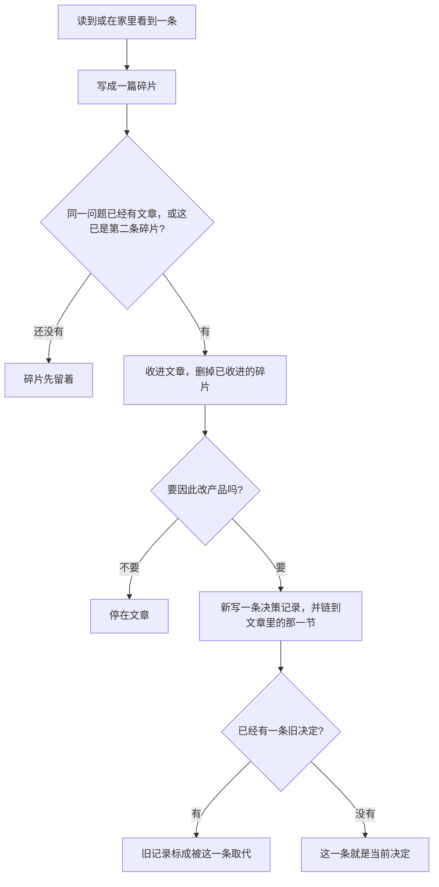

# 如何记下理论

这条教程走一遍：一条零散的看法，怎样变成文章，又怎样在改产品时留下决策记录。做完一遍即可。后面每次照同一条路走。

理论文章回答「以孩子的年龄，这样的金钱经验站不站得住」。它不代替正式需求，也不代替代码现在怎样运行。自媒体稿从文章里写出去，不另存一份理论。

## 整条路

## 用水位走一遍

下面用已经谈过的水位做演示。演示里的文件先不要为了学习而真的建出来；真的要记时，再按这些名字去写。

1. 看到一条就写碎片。例如：页面上的存钱罐用水位表示还剩多少，这个年龄看得出少了。文件放在 `fragments/2026-09-27-水位能看出少了.md`。写上来源、年龄（芊芊 4 岁 1 个月，万万 2 岁 11 个月）、这一句主张、它可能影响的问题（周期中间水位怎么变）。碎片还不能当依据。
2. 同一问题有了第二条，或已经有文章，就收进文章。文章放在本目录，例如 `水位.md`。把两句主张写成连贯的一段，来源写在文末。然后删除已经写进文章的碎片。
3. 文章里的主张若要变成产品做法，再写 `docs/decisions/0001-周期中水位只因交换下降.md`。决定段只写产品将怎样做，并链接 `水位.md` 里的那一节。不要把整篇文章抄进决策记录。
4. 以后文章改了主张，或者家里用下来要换做法：新写 `0002-….md`，链接新的那一节，并把 `0001` 标成 `Superseded by 0002`。`0001` 的决定段不要改。

设计正式需求时，只读文章和已接受的决策记录。不要把碎片或已取代的决策记录当作现在的依据。
